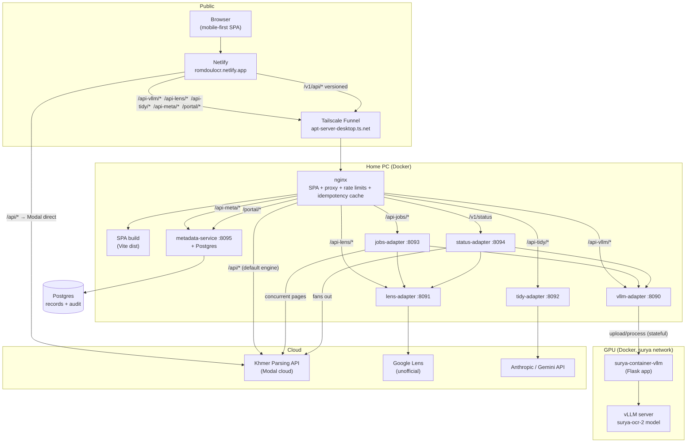
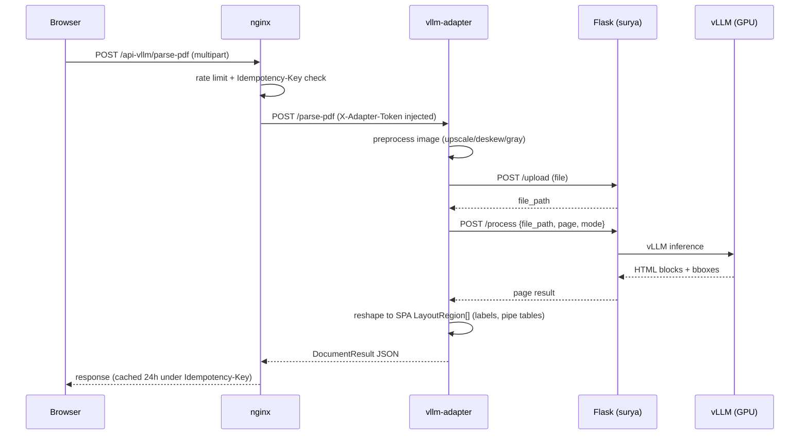
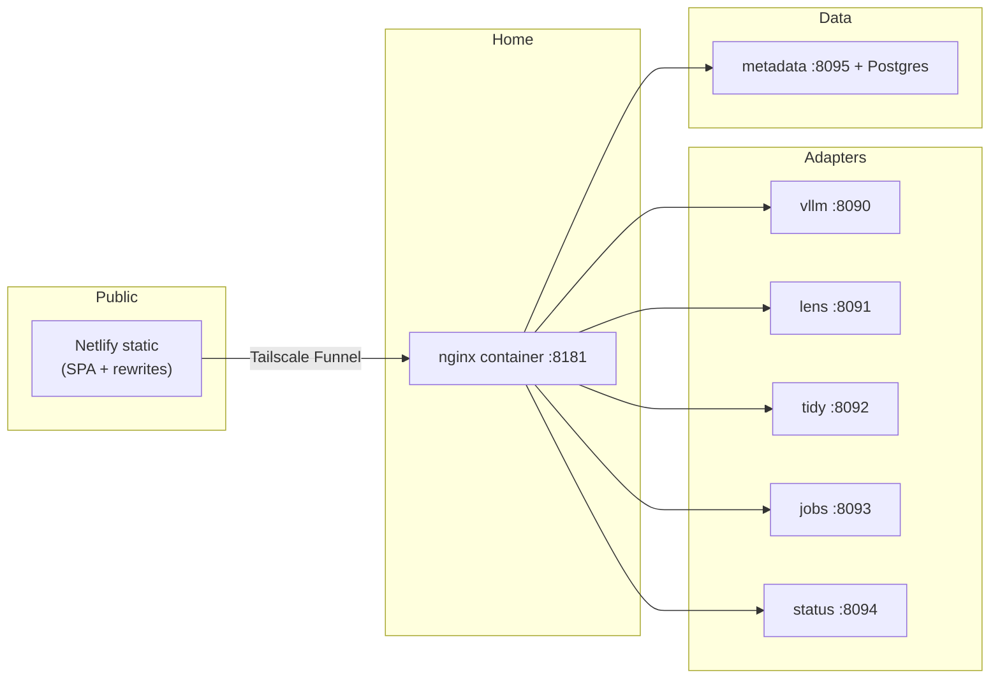

# Romdoul System Architecture

The Romdoul stack: a mobile-first Khmer OCR SPA, five FastAPI adapter sidecars,
a local Surya OCR 2 · vLLM GPU stack, a metadata service + analyst portal, and
the hosting glue (nginx, Netlify, Tailscale) that puts it on the internet.

Repos (all under `C:\Users\USER\work\`):

| Repo | Role |
|---|---|
| `ocrapi_backup` | The SPA + nginx + Netlify config + all 5 adapter sidecars |
| `surya-container-testing` | Local OCR engine: Surya OCR 2 served by vLLM (Flask app on top) |
| `metadata-service` | Extraction metadata store + analyst portal (FastAPI + Postgres + React) |
| `romdoul-dataset` | Public CPI dataset built from OCR sessions |

## System diagram

## Data flow — one OCR call

## Engine matrix

| Engine | Adapter | Path | Default | Translation | Notes |
|---|---|---|---|---|---|
| vLLM | `vllm-adapter` | `/api-vllm/*` | **✅ default** | ❌ | Local, free; needs GPU container up; auto-fallback to cloud when down |
| Cloud | — (nginx direct) | `/api/*` | fallback | ✅ | Fallback engine when GPU is offline |
| Lens | `lens-adapter` | `/api-lens/*` | optional | ✅ | Google Lens (unofficial); ToS caveat; benchmarking |
| Tidy | `tidy-adapter` | `/api-tidy/*` | — | — | 3-step prompt pipeline (profile→diagnose→code) |
| Jobs | `jobs-adapter` | `/api-jobs/*` | — | — | Async submit/poll, resume on restart |
| Status | `status-adapter` | `/v1/status` | — | — | Cached fan-out; `ok/degraded/down` |

**Backend selection:** fresh visitors default to vLLM (`src/lib/backend.ts`);
the health poller (`src/hooks/useHealth.ts`) auto-switches to the cloud API
when the GPU is unreachable and back again when it recovers — the header shows
a "GPU offline — using cloud" badge while fallback is active. The choice is
persisted in localStorage and overridable at any time via the header toggle.

## Key design decisions (ADRs)

### ADR-001: Same-origin proxying instead of direct API calls
**Status:** Accepted
**Context:** The Modal upstream sends no CORS headers; direct funnel URLs break
on tailnet devices (Local Network Access prompt).
**Decision:** SPA calls relative `/api*` paths; nginx (Docker) and Netlify
rewrites (public) proxy server-side. Browser only ever talks to its own origin.
**Consequences:** No CORS preflight; Netlify's ~26s proxy cap applies to the
public path; Idempotency-Key replay + rate limits live at nginx.

### ADR-002: Sidecar adapters per engine, not in-SPA logic
**Status:** Accepted
**Context:** Each engine (vLLM/Flask, Lens, Anthropic) speaks a different
contract than the SPA's khparser API.
**Decision:** One thin FastAPI sidecar per engine, reached by container name,
guarded by a shared `ADAPTER_TOKEN` secret.
**Consequences:** Adding an engine = new adapter + nginx location + status entry;
SPA tabs stay contract-stable. 5 small services vs one fat monolith.

### ADR-003: Batch jobs as an async service (not long-held connections)
**Status:** Accepted
**Context:** Bulk OCR exceeds gateway ceilings (~26s Netlify / ~300s funnel);
a 10k-doc batch can't be one HTTP call.
**Decision:** `jobs-adapter` accepts upload → returns `job_id` (202) → OCRs pages
concurrently under semaphores → spills results to disk → streams merged result.
Crash recovery resumes unfinished jobs at startup (max 3 resumes).
**Consequences:** Pipelines submit/poll; page failures are per-page, never
job-killing; results stream as JSONL/CSV without loading whole files.

### ADR-004: Metadata as a fire-and-forget side effect
**Status:** Accepted
**Context:** Every parse should feed Data management without ever breaking OCR.
**Decision:** SPA POSTs to `/api-meta/api/v1/records` (open, idempotent by client
id, 2s cap) — unreachable metadata service never affects parsing. `/portal`
serves the analyst UI same-origin.
**Consequences:** Open ingest endpoint requires the nginx rate limit; portal
reads/edits are login-gated.

### ADR-005: Open API with rate limits, not auth, on the GPU path
**Status:** Accepted (revisit before public exposure)
**Context:** One GPU behind the stack; the funnel URL is shared.
**Decision:** No user auth; nginx rate limits (2 req/s sustained, burst 40) +
Idempotency-Key replay + `ADAPTER_TOKEN` on local sidecars.
**Consequences:** Any URL-holder can call, but burst damage is bounded; real
auth/keys documented as the pre-public-exposure step in INTEGRATION.md.

## Deployment topology

- Public SPA: Netlify build (`npm run build` → `dist`), rewrites proxy engine
  calls to Modal directly and sidecars via the funnel.
- Home: nginx container serves the SPA and proxies; adapters + metadata join
  the `surya-container-vllm_default` Docker network; `tailscale funnel --bg 8181`.
- GPU: `docker compose -f docker-compose.vllm.yml up` (vLLM server + Flask app).

## Rate limits (nginx)

| Zone | Rate | Purpose |
|---|---|---|
| `api_rl` | 120 req/min, burst 40 | all OCR/API calls per client |
| `health_rl` | 600 req/min, burst 20 | health/status polling |
| Idempotency cache | 24h | retry returns original result, no re-OCR |

Errors: structured JSON `{error:{code,message}}` with `429/413/502/504` maps
and `Retry-After` headers for pipeline-safe backoff.
